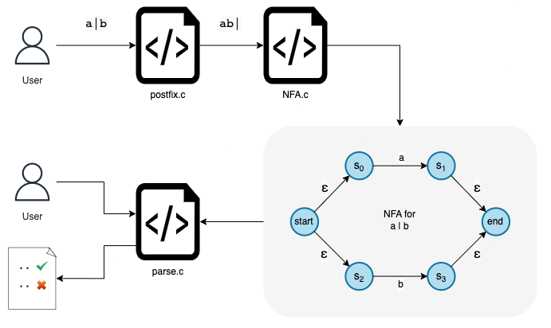

## REGULAR EXPRESSION ENGINE 

#### Introduction

A regular expression represents a pattern that can be used to match a string of characters. For example `a|b*` is a regular expression that matches a string of characters containing a single character `a`, an empty string `''` or one or more characters of `b`. 

A regular expreesion can be represented as a Finite State Machine (`FA`). Any set of strings that reaches the end state of this `FA` will correspond to the regular expression.

#### Syntax

Following operators are supported by this Regex Engine

|Operator | Symbol  | Regex| Strings |
|---|---|---|---|
| Union | `|` | `a|b` | eg: `a`, `b`|
| Concatenation | `.` | `a.b` | eg: `ab`|
| Closure | `*` | `a*` | eg: `''`, `a`, `aa`, `aaa`|

**NOTE**: `(` and `)` can also be used to construct a regular expression.

#### Order of execution
The precendence order of the operators are as follows:

1. Parentheses
2. Closure
3. Concatenation
4. Union


For example: A regular expression `a.b.c|(d.e)*` will be executed as follows
```
    a  .  b  .  c   |  (d  .  e)  *
    -------------------------------
    │     │     │   │  └── 1 ──┘  │
    │     │     │   │      └─ 2 ──┘
    └─ 3 ─┘     │   │
       └─── 4 ──┘   │
            └─── 5 ─┘ 
```


#### Build
Use `make` utility to build and execute.

* To compile/build
    ```
    make build
    ```
* To execute engine
    ```
    make run
    ```
* To run test cases
    ```
    make test
    ```
* To clean all object files
    ```
    make clean
    ```

#### Architecture



Following constants can be modified based on the application in a constants file `include/Constants.h`

1. `HASHSIZE` : size of a custom hasmap used
2. `TOTAL_STATES`: Maximum number of states an NFA can contain
3. `VISITED_EPSILON` : Maximum number of epsilon states a NFA can contain
4. `INFIX_SIZE`: maximum size of a regex
5. `PATTERN_SIZE`: maximum characters a pattern can contain
6. `TEST_SIZE`: maximum number of test cases in `test.txt`
7. `LOG_SIZE`: maximum legth of a log output.
8. `LOG_PATH`: path to log file `data/raw/regex.log`
9. `TEST_PATH`: path to test file
10. `BANNER_PATH_INTRO`: path to banner
11. `BANNER_PATH_END`: path to banner

#### Running Test cases

Test cases are recorded in a semicolon seperated file `test.txt`. The first column of the file represents the Regex whereas all columns from second to last represents multiple pattern

```
re_1; pattr_11; pattr_12; pattr_13; .....
re_2; pattr_21; pattr_22; pattr_23; .....
```


#### REFERENCE
*  [Implementing a Regular Expression Engine by Denis Kyashif](https://deniskyashif.com/2019/02/17/implementing-a-regular-expression-engine/)